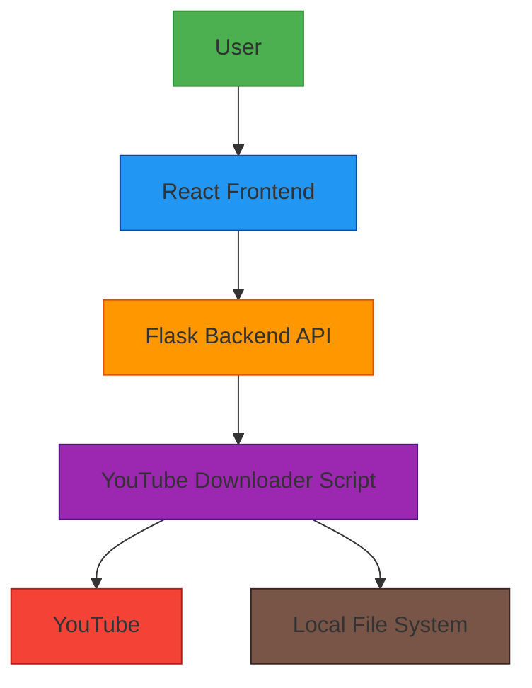

# YouTube Downloader Architecture

## Components

1. **User**: Interacts with the React frontend through a web browser
2. **React Frontend**: Web interface that provides a user-friendly form for downloading videos
3. **Flask Backend API**: REST API that handles requests from the frontend and executes the downloader script
4. **YouTube Downloader Script**: Python script that uses yt-dlp to download videos from YouTube
5. **YouTube**: The video platform from which content is downloaded
6. **Local File System**: Where downloaded videos are saved

## Data Flow

1. User enters YouTube URL and selects download options in the React frontend
2. Frontend sends a request to the Flask backend API with the download parameters
3. Backend API validates the request and calls the YouTube downloader script
4. Downloader script connects to YouTube and downloads the requested content
5. Downloaded content is saved to the local file system
6. Backend API returns success/failure status to the frontend
7. Frontend displays the result to the user

## Ports

- React Frontend: http://localhost:3000
- Flask Backend API: http://localhost:5000