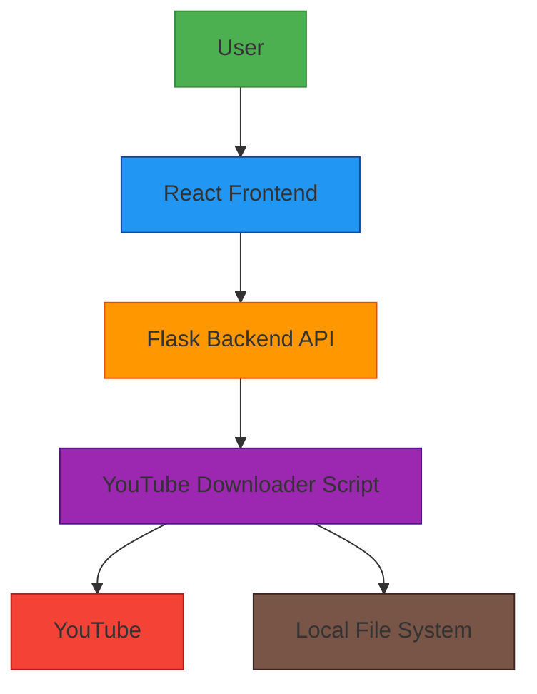

# YouTube Video Downloader with yt-dlp Integration

A command-line based YouTube Video Downloader that integrates with yt-dlp to allow users to download videos from YouTube in various formats and resolutions.

## Features

- **Download YouTube Videos**: Download videos in various resolutions (360p, 720p, 1080p, etc.)
- **Audio Extraction**: Extract and download only the audio from a YouTube video
- **Multiple Formats**: Support for multiple video formats like MP4, WebM, and audio formats like MP3, M4A
- **Batch Downloading**: Download multiple videos at once by providing a list of URLs
- **Simple Command-Line Interface**: Easy-to-use command-line input for seamless user experience
- **Web Interface**: React-based frontend for easier usage

## Requirements

- Python 3.6 or higher
- yt-dlp package
- Flask (for web API)
- Flask-CORS (for web API)
- Node.js (for frontend, version 14 or higher)
- npm (for frontend)

## Installation

1. Clone the repository:
   ```bash
   git clone https://github.com/yourusername/YouTube-Video-Downloader.git
   cd YouTube-Video-Downloader
   ```

2. Install the required Python dependencies:
   ```bash
   pip install -r requirements.txt
   ```

3. Install frontend dependencies:
   ```bash
   cd frontend
   npm install
   cd ..
   ```

## Usage

### Command-Line Interface

To download a YouTube video in the default format (720p MP4):

```bash
python youtube_downloader.py https://www.youtube.com/watch?v=VIDEO_ID
```

### Web Interface

1. Start the backend API server:
   ```bash
   python app.py
   ```

2. In a new terminal, start the frontend development server:
   ```bash
   cd frontend
   npm start
   ```

3. Open your browser and navigate to `http://localhost:3000`

### Specify Resolution and Format

```bash
python youtube_downloader.py https://www.youtube.com/watch?v=VIDEO_ID -r 1080p -f mp4
```

### Extract Audio Only

```bash
python youtube_downloader.py https://www.youtube.com/watch?v=VIDEO_ID -a --audio-format mp3
```

### Batch Download Multiple Videos

```bash
python youtube_downloader.py https://www.youtube.com/watch?v=VIDEO_ID1 https://www.youtube.com/watch?v=VIDEO_ID2
```

### Change Output Directory

```bash
python youtube_downloader.py https://www.youtube.com/watch?v=VIDEO_ID -o /path/to/output/directory
```

## Environment Variables

The application supports the following environment variables:

### PORT
- **Purpose**: Specifies the port on which the Flask application will run
- **Default**: 5000
- **Usage**: Automatically used by Render and other cloud platforms
- **Example**: `PORT=8000`

For more environment variables and how to use them, see [ENVIRONMENT_VARIABLES.md](ENVIRONMENT_VARIABLES.md).

## Command-Line Options

- `urls`: YouTube video URL(s) to download
- `-o, --output-dir`: Directory to save downloaded files (default: downloads)
- `-r, --resolution`: Video resolution (e.g., 360p, 720p, 1080p, best) (default: 720p)
- `-f, --format`: Video format (e.g., mp4, webm) (default: mp4)
- `-a, --audio-only`: Extract audio only
- `--audio-format`: Audio format when using --audio-only (e.g., mp3, m4a) (default: mp3)

## Web Interface Features

The React-based web interface provides:
- A clean, user-friendly form for entering YouTube URLs
- Options for selecting resolution and format
- Audio-only download option
- Real-time download status updates
- Responsive design that works on desktop and mobile devices

## Examples

1. Download a video in best quality:
   ```bash
   python youtube_downloader.py https://www.youtube.com/watch?v=VIDEO_ID -r best
   ```

2. Download multiple videos in 480p WebM format:
   ```bash
   python youtube_downloader.py https://www.youtube.com/watch?v=VIDEO_ID1 https://www.youtube.com/watch?v=VIDEO_ID2 -r 480p -f webm
   ```

3. Extract audio from multiple videos in M4A format:
   ```bash
   python youtube_downloader.py https://www.youtube.com/watch?v=VIDEO_ID1 https://www.youtube.com/watch?v=VIDEO_ID2 -a --audio-format m4a
   ```

## API Endpoints

The Flask backend provides the following API endpoints:

- `POST /api/download` - Download a YouTube video or extract audio
- `GET /api/status` - Check if the API is running

## Project Structure

- `youtube_downloader.py` - Main Python script for downloading videos
- `app.py` - Flask backend API
- `requirements.txt` - Python dependencies
- `frontend/` - React-based web interface
  - `src/App.js` - Main React component
  - `src/App.css` - Styles for the web interface

## Running the Application

### Method 1: Separate Terminals

1. Start the backend API server:
   ```bash
   python app.py
   ```

2. In a new terminal, start the frontend development server:
   ```bash
   cd frontend
   npm start
   ```

3. Open your browser and navigate to `http://localhost:3000`

### Method 2: Using npm Scripts (if available)

```bash
# Install dependencies (if not already done)
npm run install-deps

# Start the backend server (in background)
npm run dev &

# Start the frontend
npm run frontend
```

## Deploying to Render (Backend)

This application is configured for easy deployment to Render. For detailed instructions, see [README.Render.md](README.Render.md).

### Quick Deploy to Render:

1. Fork this repository to your GitHub account
2. Sign up at [render.com](https://render.com)
3. Create a new Web Service
4. Connect your GitHub repository
5. Use these settings:
   - Build command: `./build.sh`
   - Start command: `gunicorn app:app`
6. Deploy!

The application will automatically build the frontend and serve both the API and frontend from a single server.

Your backend is currently deployed at: `https://youtube-downloader-i1z1.onrender.com`

## Deploying to Vercel (Frontend) + Render (Backend)

For a more scalable deployment, you can deploy the frontend to Vercel and keep the backend on Render.

### Steps:

1. Deploy the backend to Render (already done at `https://youtube-downloader-i1z1.onrender.com`)
2. Deploy the frontend to Vercel:
   - Sign up at [vercel.com](https://vercel.com)
   - Import your GitHub repository
   - Set Root Directory to `frontend`
   - Add environment variable `REACT_APP_API_URL` with value: `https://youtube-downloader-i1z1.onrender.com`
   - Deploy!

For detailed instructions, see [frontend/README.Vercel.md](frontend/README.Vercel.md).

## Architecture

The application follows a client-server architecture:



For more details about the architecture, see [ARCHITECTURE.md](ARCHITECTURE.md).

## License

This project is licensed under the MIT License - see the LICENSE file for details.

## Acknowledgments

- [yt-dlp](https://github.com/yt-dlp/yt-dlp) - The powerful downloader that this tool is built upon
- [React](https://reactjs.org/) - JavaScript library for building user interfaces
- [Flask](https://flask.palletsprojects.com/) - Python web framework